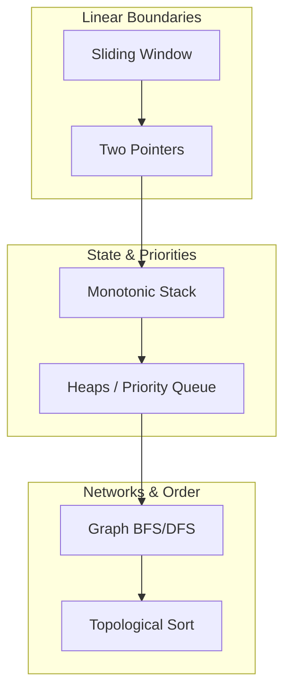

# High-Throughput DSA & System Design Engine

A production-grade Java repository mapping advanced algorithmic patterns directly to large-scale infrastructure components. 

## 🗺️ The Tiered Interview Roadmap

## 📈 System Progress Tracker

| Phase | Pattern | Target System Component | LeetCode Tier | Status | Link to Blueprint |
| --- | --- | --- | --- | --- | --- |
| **Phase 1** | Sliding Window | Rate Limiter (Sliding Window Counter) | Medium / Hard | 🔄 In Progress | [View](./src/main/java/com/engine/phase1_foundations/sliding_window/PATTERN_BLUEPRINT.md) |
| **Phase 1** | Two Pointers | Real-time Data Deduplication / Merging | Medium | 🛑 Todo | [View](./src/main/java/com/engine/phase1_foundations/two_pointers/PATTERN_BLUEPRINT.md) |
| **Phase 2** | Monotonic Stack | Event Metric Streaming (Next Max Spike) | Medium / Hard | 🛑 Todo | [View](./src/main/java/com/engine/phase2_structural/monotonic_stack/PATTERN_BLUEPRINT.md) |
| **Phase 2** | Heaps / PQ | Distributed Top-K Heavy Hitters Tracker | Medium / Hard | 🛑 Todo | [View](./src/main/java/com/engine/phase2_structural/heaps_and_priority/PATTERN_BLUEPRINT.md) |
| **Phase 3** | Graph BFS/DFS | Microservice Call Graph Trace Optimizer | Medium | 🛑 Todo | [View](./src/main/java/com/engine/phase3_distributed/graph_traversals/PATTERN_BLUEPRINT.md) |
| **Phase 3** | Topological Sort | Distributed Task Scheduler / CI-CD Engine | Hard | 🛑 Todo | [View](./src/main/java/com/engine/phase3_distributed/topological_sort/PATTERN_BLUEPRINT.md) |

*Status options: 🟢 Mastered | 🔄 In Progress | 🛑 Todo*
