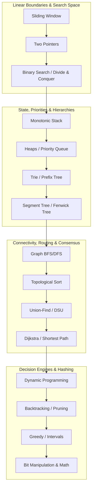

# High-Throughput DSA & System Design Engine

A production-grade Java repository mapping advanced algorithmic patterns directly to large-scale infrastructure components. 

> [!TIP]
> Before starting, review the [Study Protocol & Recalibration Guide](./docs/study_protocol.md) to understand the 6–8 problem mastery ladder and the weekly testing protocol.

## 🗺️ The Tiered Interview Roadmap

## 📈 System Progress Tracker

| Phase | Pattern | Target System Component | LeetCode Tier | Status | Link to Blueprint |
| --- | --- | --- | --- | --- | --- |
| **Phase 1** | Sliding Window | Rate Limiter (Sliding Window Counter) | Medium / Hard | 🔄 In Progress | [View](./src/main/java/com/engine/phase1_foundations/sliding_window/PATTERN_BLUEPRINT.md) |
| **Phase 1** | Two Pointers | Real-time Data Deduplication / Merging | Medium | 🛑 Todo | [View](./src/main/java/com/engine/phase1_foundations/two_pointers/PATTERN_BLUEPRINT.md) |
| **Phase 1** | Binary Search | LSM-Tree SSTable Index Lookup | Medium | 🔄 In Progress | [View](./src/main/java/com/engine/phase1_foundations/binary_search/PATTERN_BLUEPRINT.md) |
| **Phase 2** | Monotonic Stack | Event Metric Streaming (Next Max Spike) | Medium / Hard | 🛑 Todo | [View](./src/main/java/com/engine/phase2_structural/monotonic_stack/PATTERN_BLUEPRINT.md) |
| **Phase 2** | Heaps / PQ | Distributed Top-K Heavy Hitters Tracker | Medium / Hard | 🛑 Todo | [View](./src/main/java/com/engine/phase2_structural/heaps_and_priority/PATTERN_BLUEPRINT.md) |
| **Phase 2** | Trie | Longest Prefix Match (IP Router) | Medium / Hard | 🛑 Todo | [View](./src/main/java/com/engine/phase2_structural/trie/PATTERN_BLUEPRINT.md) |
| **Phase 2** | Segment Tree | Telemetry Metric Range Query Engine | Hard | 🛑 Todo | [View](./src/main/java/com/engine/phase2_structural/segment_tree/PATTERN_BLUEPRINT.md) |
| **Phase 3** | Graph BFS/DFS | Microservice Call Graph Trace Optimizer | Medium | 🛑 Todo | [View](./src/main/java/com/engine/phase3_distributed/graph_traversals/PATTERN_BLUEPRINT.md) |
| **Phase 3** | Topological Sort | Distributed Task Scheduler / CI-CD Engine | Hard | 🛑 Todo | [View](./src/main/java/com/engine/phase3_distributed/topological_sort/PATTERN_BLUEPRINT.md) |
| **Phase 3** | Union-Find (DSU) | Distributed Network Partition Detector | Medium / Hard | 🛑 Todo | [View](./src/main/java/com/engine/phase3_distributed/union_find/PATTERN_BLUEPRINT.md) |
| **Phase 3** | Dijkstra / Shortest Path | Service Mesh RPC Traffic Routing | Medium / Hard | 🛑 Todo | [View](./src/main/java/com/engine/phase3_distributed/shortest_paths/PATTERN_BLUEPRINT.md) |
| **Phase 4** | Dynamic Programming | Cloud Instance Load Balancer | Medium / Hard | 🛑 Todo | [View](./src/main/java/com/engine/phase4_optimization/dynamic_programming/PATTERN_BLUEPRINT.md) |
| **Phase 4** | Backtracking | SQL Relational Query Execution Planner | Medium / Hard | 🛑 Todo | [View](./src/main/java/com/engine/phase4_optimization/backtracking/PATTERN_BLUEPRINT.md) |
| **Phase 4** | Greedy / Intervals | Thread Pool Task Scheduler (SJF/EDF) | Medium | 🛑 Todo | [View](./src/main/java/com/engine/phase4_optimization/greedy_intervals/PATTERN_BLUEPRINT.md) |
| **Phase 4** | Bit Manipulation / Math | Bloom Filter & HyperLogLog Estimation | Medium / Hard | 🛑 Todo | [View](./src/main/java/com/engine/phase4_optimization/bit_manipulation/PATTERN_BLUEPRINT.md) |

*Status options: 🟢 Mastered | 🔄 In Progress | 🛑 Todo*
