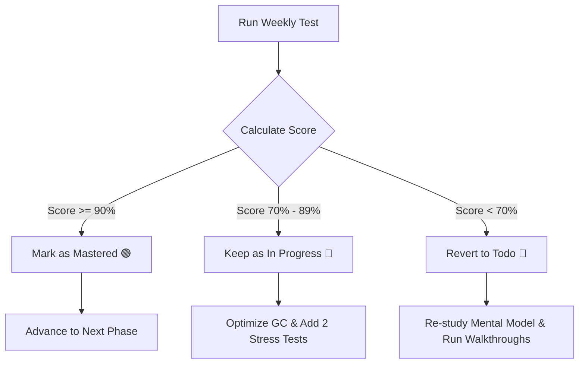

# Study Protocol & Recalibration Guide

This document defines the learning framework, target problem volume, weekly evaluation protocol, and recalibration rules for the DSA & System Design Engine.

---

## 🎯 Target Problem Volume: The 6–8 Rule

To master an algorithmic pattern without getting stuck in a cycle of endless grinding, aim for **6 to 8 highly targeted problems** per pattern. This volume is structured as a progressive difficulty ladder:

### The Mastery Ladder
```text
  [Level 3: Scale & Boundary Stress]  -->  1 - 2 Hard problems (Extreme bounds, overflow, quants tier)
                  ▲
  [Level 2: Systems Integration]       -->  3 - 4 Medium problems (Direct mappings to system design components)
                  ▲
  [Level 1: Structural Invariant]      -->  1 - 2 Easy/Medium problems (Understand basic template & index bounds)
```

1. **Level 1: Structural Warmups (1–2 Problems)**
   * **Goal:** Internalize the core pattern invariants and standard template.
   * **Focus:** Pointer movements, base cases, loop termination, and index boundaries.
2. **Level 2: Systems Core (3–4 Problems)**
   * **Goal:** Implement the direct mapping to real-world infrastructure components (e.g. Sliding Window Rate Limiter).
   * **Focus:** Low-level performance, cache locality, and zero-autoboxing.
3. **Level 3: Scale & Stress (1–2 Problems)**
   * **Goal:** Handle extreme scale, concurrency, or mathematical constraints (quant/hard interview tier).
   * **Focus:** Minimizing JVM GC pressure, time-limit-exceeded (TLE) prevention, and raw memory optimization.

*Total Curriculum Size: 15 Patterns × 6–8 Problems = 90–120 high-quality problems.*

---

## 📊 Weekly Testing Protocol

At the end of each week, schedule a **90-minute timed testing session** to evaluate retention, speed, and efficiency under mock interview constraints.

### 1. Test Setup
* **Coverage:** Select 3 problems:
  * **2 Problems** from the patterns studied during the current week.
  * **1 Problem** selected randomly from a previously mastered pattern (spaced repetition).
* **Constraints:** Timed (90 minutes total), no AI tools, and no documentation lookups. Use the [TestDataGenerator](file:///Users/joe/Documents/projects/DSA-prep/src/test/java/com/engine/TestDataGenerator.java) to generate stress inputs (100,000+ elements) for verification.

### 2. Grading Rubric
Your solution is graded on three criteria:
1. **Algorithmic Correctness (40%):** Passes all functional edge cases, boundary parameters (nulls, empty collections), and integer bounds.
2. **Time Complexity (30%):** Meets optimal asymptotic bounds ($O(N)$ or $O(\log N)$) and passes stress-test scales without TLE.
3. **Memory & JVM Efficiency (30%):** Achieves zero object-boxing in loops, utilizes flat primitive arrays, and maintains a clean GC profile under high throughput.

---

## 🔄 Recalibration & Progress Rules

Based on the weekly test results, update the status in the [README.md](file:///Users/joe/Documents/projects/DSA-prep/README.md) tracker using the following rules:



### Recalibration Action Items

* **Grade: Mastered (`🟢 Mastered`)**
  * *Threshold:* Passes all correctness tests + achieves optimal space/time bounds + enforces zero-boxing.
  * *Action:* Update progress tracker to `🟢 Mastered`. Advance to the next phase on the roadmap.
* **Grade: Optimizing (`🔄 In Progress`)**
  * *Threshold:* Passes correctness, but triggers TLE on large scales, or uses boxed classes (GC overhead).
  * *Action:* Keep status as `🔄 In Progress`. Rewrite code to use flat primitive arrays and pre-allocated buffers. Run stress tests again.
* **Grade: Remedial (`🛑 Todo`)**
  * *Threshold:* Struggles with the core invariant logic, hits stack overflow, or fails multiple basic edge cases.
  * *Action:* Revert status to `🛑 Todo`. Open the pattern's `PATTERN_BLUEPRINT.md` and read the *Core Structural Trick (Mental Model)* again. Request a step-by-step trace from AI to inspect index movements.
